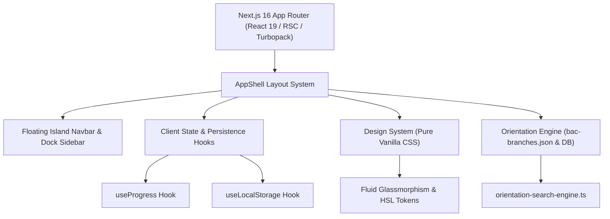

# 🇩🇿 THE ULTIMATE BAC HELP (باك الجزائر | رفيقك في التحضير)
# MASTER PROJECT RESUME & FULL TECHNICAL SPECIFICATIONS
> **For AI Assistants (Gemini, Claude, Antigravity) & Lead Developers**
> **Last Updated:** August 2026 (Reflecting Official MESRS 2026 Orientation Decree & July 29, 2026 Education Ministry Decree)

---

## 📌 1. EXECUTIVE SUMMARY & MISSION

**The Ultimate BAC Help** is a state-of-the-art, high-performance web application tailored specifically for Algerian Baccalaureate students (3AS - السنة الثالثة ثانوي) preparing for their national exams and university orientation.

### Core Pillars of the Platform:
1. **Interactive News & Official Updates Feed (`/` - Homepage)**:
   - **Hero Live Status & Countdown Card**: Real-time countdown timer to BAC 2026/2027 and live ministerial news tag (`● مباشر | آخر الأخبار والمستجدات`).
   - **Ministerial Agent Hero Card (`MinisterialCard`)**: Displays official ministerial announcements, hero images, badges (`🚨 عاجل`), AI agent simplified explanations (`💡 الشرح المبسط للطالب`), and direct links to official sources (`education.gov.dz` / `mesrs.dz`).
   - **Categorized News Feed (`NewsFeed`)**: Interactive category tabs (`🌐 الكل`, `🏛️ قرارات وزارية`, `📚 تحديثات المحتوى`, `💡 نصائح ومنهجية`, `🎯 اختبارات وأدوات`) with expandable news cards and direct tool shortcuts.
   - **Local JSON Data Layer (`src/data/news-feed.json` & `src/lib/news-service.ts`)**: Fast, zero-latency server-side file IO (`fs/promises`) with clean separation between client-safe types (`src/data/news-data.ts`) and server-only data persistence.
   - **Verified Href LLM Scraper Agent (`/api/news/sync`)**: Context-aware LLM Scraper with strict anti-hallucination rules. Pre-extracts actual `href` tags from HTML and constrains `gemini-2.5-flash` to select links exclusively from verified HTML attributes, eliminating 404 links.
   - **Safe PDF Link Guard (`hasValidPdf`)**: Client-side verification rule ensuring PDF download buttons are rendered only when a valid, non-null `.pdf` document URL exists.
   - **Verified Href LLM Scraper Agent (`/api/news/sync`)**: Context-aware LLM Scraper with strict anti-hallucination rules. Pre-extracts actual `href` tags from HTML and constrains `gemini-2.5-flash` to select links exclusively from verified HTML attributes, eliminating 404 links.
   - **Safe PDF Link Guard (`hasValidPdf`)**: Client-side verification rule ensuring PDF download buttons are rendered only when a valid, non-null `.pdf` document URL exists.
   - **Comprehensive Subject Manifest Expansion (`src/data/bac-content.ts`)**: Integrated all newly added files & subfolders across **اللغة العربية** (End-of-year summaries, common language construction questions, patterns, poetry characteristics) and **التاريخ والجغرافيا** (Indirect exam questions, scientific stream revolution lessons, liberation movements intro/dates/definitions, maps, and economic poles common traits).

2. **University Orientation & Threshold Predictor Engine (`/tools/orientation`)**:
   - Complete, exhaustive dataset of **2,346 university branches** across all **58 Wilayas** in Algeria, extracted directly from official MESRS Circulaire 01 and Phase-1 Cutoffs.
   - **Official 3-Tier Cutoff System (`Min1`, `Min2`, `Min3`)**:
     - Linked directly to `BAC-2026-Fichier-des-moyennes-minimales-apres-phase-1.pdf` across all 2,346 university branches.
     - ESI Algiers (`C00CAN01`), ESI Sidi Bel Abbes (`C00CAN02`), ESTIN Bejaia (`C00CAN03`), ENSIA AI (`C00CAN04`), Cybersecurity (`C00CAN07`), ENSM Math (`C00CAN05`):
       - Formula `MI`: $\mathfrak{g^i} = \frac{2 \times \text{BAC} + \text{Math}}{3}$
       - ESI Algiers (`C00CAN01`): `Min1` (Math) = **18.13**, `Min2` (Sci) = **18.48**, `Min3` (Tech) = **18.91**
       - ENSIA AI (`C00CAN04`): `Min1` (Math) = **18.44**, `Min2` (Sci) = **18.81**, `Min3` (Tech) = **19.21**
       - Cybersecurity (`C00CAN07`): `Min1` (Math) = **18.10**, `Min2` (Sci) = **18.46**, `Min3` (Tech) = **18.85**
       - ENSM Math (`C00CAN05`): `Min1` (Math) = **17.43**, `Min2` (Sci) = **17.77**, `Min3` (Tech) = **18.13**
     - Autonomous Systems (`A00CAN13`), Nanotechnology (`A00CAN14`):
       - Formula `ST`: $\mathfrak{g^i} = \frac{2 \times \text{BAC} + \frac{\text{Physique} + \text{Math}}{2}}{3}$
       - ENSSA Autonomous Systems (`A00CAN13`): `Min1` = **18.06**
       - ENSNN Nanotechnology (`A00CAN14`): `Min1` = **17.69**
     - Interactive priority badges (`🥇 أولوية أولى`, `🥈 أولوية ثانية`, `🥉 أولوية ثالثة`) and stream-specific target cutoffs rendered on every result card.
   - **Official Domain Stream Priorities (`bac-domain-stream-priorities.json` / `.md`)**:
     - Aligned all 19 official MESRS registration domains from Page 5 of Circulaire 2026.
     - Added official **Arts stream (`Arts` / فنون)** support across `StreamKey`, `streamLabels`, data schemas, and search engines.
   - Dual-Mode Interface:
     - **Mode 1: Predictor Explorer (📊 مستكشف التوجيه بمعدلي)**: Instant real-time evaluation with 5 color-coded status badges (`🟢 مضمونة`, `🟡 منافسة قوية`, `🔴 تتطلب رفع النقاط`, `⚪ خاضع للمرحلة الثانية NC`, `⛔ غير متاح لشعبتك`).
     - **Mode 2: Dream University Calculator (🎯 حاسبة جامعة أحلامي)**: Smart target search box with mobile-optimized interactive autocomplete cards.
   - 8 Structural Categories (`Medical`, `HigherSchool`, `Engineering`, `ENS`, `DoubleDegree`, `Professional`, `DistanceLearning`, `University`).
   - 7 Career Goal Classifications (Doctor 🩺, Software/AI 💻, Teacher 👨‍🏫, Architect 🏛️, Engineer ⚙️, Business/Finance 📊, General 🌐).
   - Multilingual Fuzzy Search Engine (`src/lib/orientation-search-engine.ts`) supporting Arabic, French, official codes, and regional aliases.
   - Exact Weighted Average Formulas ($\mathfrak{g^i}$) for Health, ST, MI, AUM, Languages, Translation, and General fields.
2. **Curated Academic Library (`/subject/[id]`)**: High-quality summaries, past exam archives, unit checklists, and textbook resources categorized by subject.
3. **Official BAC Grade Calculator (`/calculator`)**: Real-time BAC grade calculation supporting 7 official streams according to the July 29, 2026 decree.
4. **Coefficient-Weighted Progress Tracking Engine (`/progress`)**: Calculates a weighted readiness index (`bacReadinessIndex`) based on stream coefficients rather than flat lesson counts.
5. **Prerequisites Diagnostic & Comprehensive Exercises (`/tools/prerequisites/quiz`)**:
   - Complete 3-subject diagnostic engine (Mathematics ∑, Physical Sciences ⚛, Natural Sciences 🧬).
   - Dual-Mode Architecture:
     - **Mode 1: Interactive Diagnostic Quiz (⏱ 10 Questions per subject)**: Real-time progress bar, MCQ & True/False inputs, instant scientific explanations, and comprehensive diagnostic reporting with score badges.
     - **Mode 2: Comprehensive Solved Exercise (📝 التمرين الشامل المحلول)**: Complete problem statements with step-by-step model solution toggles. Natural Sciences features high-resolution original document images (`exercise-1.jpg`, `exercise-2.jpg`, `solution-1.jpg`, `solution-2.jpg`).
   - Built with Next.js 16 Client Component, pure Vanilla CSS design system, and full Mobile-First touch compliance ($\ge 48\text{px}$).
   - **KaTeX Dynamic LaTeX Engine (`<MathText/>`)**: Automatically parses and renders inline ($...$) and block ($$...$$) mathematical expressions into high-resolution rendered equations across questions, MCQ options, explanations, and exercises.
6. **External Tools & Resource Directory (`/tools`)**: Curated study applications (YPT, Quizlet, NotebookLM), top YouTube educators, prerequisite guides, and external textbooks.
7. **RTL & Accessibility Precision**: Native Right-to-Left (RTL) Arabic interface with full W3C BiDirectional (BiDi) isolation (`<bdi>`) to prevent text/number scrambling.

---

## 🏗️ 2. TECHNOLOGY STACK & ARCHITECTURE



- **Framework**: **Next.js 16** (App Router architecture, Turbopack engine).
- **Mobile Subject Navigation Bar (`MobileSubjectBar`)**: Replaced the upper mobile streams bar with a horizontal scrolling navigation bar displaying available subjects (Math, Science, Physics, Arabic, History/Geo, Philosophy, Islamic, French, English) with icons, direct links, and Touch-friendly `min-height: 48px` buttons.
- **Language**: **TypeScript** (Strict Mode, JSON module imports).
- **Data Engine**: `src/data/bac-branches.json` (2,346 pre-indexed branches across 58 Wilayas).
- **Search Engine**: `src/lib/orientation-search-engine.ts` (Zero-latency Multilingual Fuzzy Search).
- **Styling**: Pure **Vanilla CSS** (`src/app/styles.css`) using custom properties, glassmorphism layers (`backdrop-filter: blur()`), and HSL color design tokens.
- **Directionality & Typography**: Native RTL (`dir="rtl"`, `lang="ar"`) powered by Google Fonts (`Cairo`, `Inter`, `Outfit`, `Manrope`).

---

## 📂 3. PROJECT FOLDER & FILE STRUCTURE (`bac-platform/`)

```
bac-platform/
├── src/
│   ├── app/
│   │   ├── layout.tsx                # Root HTML layout with RTL metadata & Cairo font
│   │   ├── page.tsx                  # Home Dashboard (Hero, Countdown, Quick Links, Live Ticker)
│   │   ├── styles.css                # Master Global Design System & Utility Tokens
│   │   ├── subject/[id]/             # Dynamic Subject Library Route
│   │   │   ├── page.tsx              # Subject server page resolver
│   │   │   └── subject-view.tsx      # Master Subject View component & File Cards
│   │   ├── calculator/               # Official BAC Grade Calculator Route
│   │   │   └── page.tsx              # 7-Stream Weighted Grade Calculator
│   │   ├── progress/                 # Coefficient-Weighted Progress Tracker Route
│   │   │   └── page.tsx              # Readiness Dashboard & Subject Checklists
│   │   └── tools/                    # Tools Hub Route
│   │       ├── page.tsx              # Tools index grid
│   │       ├── orientation/page.tsx  # University Orientation & Threshold Predictor (Dual-Engine)
│   │       ├── apps/page.tsx         # Recommended Study Apps (YPT, Quizlet, etc.)
│   │       ├── notebooks/page.tsx    # AI Notebooks (NotebookLM)
│   │       ├── teachers/page.tsx     # Golden YouTube Teachers List
│   │       ├── prerequisites/page.tsx# Prerequisite Videos & Guides
│   │       └── books/page.tsx        # External Textbooks
│   ├── components/
│   │   ├── layout/
│   │   │   ├── app-shell.tsx         # Main layout wrapper
│   │   │   ├── navbar.tsx            # Floating Island Navbar
│   │   │   ├── sidebar.tsx           # Navigation Sidebar Dock
│   │   │   └── bottom-nav.tsx        # Mobile Floating Pill Bottom Dock
│   │   └── effects/
│   │       └── fade-in-section.tsx   # Smooth section entrance animations
│   ├── data/                         # Data Layer
│   │   ├── bac-branches.json         # 2,346 Official MESRS 2026 University Branches Dataset
│   │   └── bac-orientation-database.ts # Type Definitions, Stream Labels & Weighted Average Formulas
│   ├── lib/
│   │   └── orientation-search-engine.ts # Zero-latency Multilingual Search & Score Evaluator
│   └── hooks/                        # Custom React Hooks (useProgress, useLocalStorage)
├── package.json
├── tsconfig.json
└── next.config.ts
```

---

## 🎓 4. DETAILED FEATURE SPECIFICATIONS

### A. 🏛️ University Orientation Engine (`/tools/orientation`)

#### 1. Dataset & Wilaya Resolution (`bac-branches.json` + `bac-orientation-database.ts`):
- **2,346 University Branches**: Extracted from MESRS Circulaire 01 and Phase-1 Cutoffs.
- **Accurate Wilaya Resolution**: Mapped all 277 institution codes directly to their true Wilaya codes (01 to 58).
  - Algiers (16): 271 true Algiers branches
  - Oran (31): 101 branches
  - Constantine (25): 112 branches
  - Setif (19): 95 branches
  - Ouargla (30): 87 branches
  - Laghouat (03): 86 branches
  - Batna (05): 78 branches
  - Saida (20): 76 branches
  - Tlemcen (13): 70 branches
  - Msila (28): 64 branches
  - Annaba (23): 58 branches
  - Biskra (07): 53 branches
  - Blida (09): 52 branches
  - Chlef (02): 50 branches
  - Tebessa (12): 49 branches
  - Bejaia (06): 48 branches
  - Tizi Ouzou (15): 48 branches
  - Skikda (21): 47 branches
  - Jijel (18): 46 branches
  - Tiaret (14): 46 branches
  - Oum El Bouaghi (04): 44 branches
  - Guelma (24): 42 branches
  - Sidi Bel Abbes (22): 39 branches
  - ... across all 58 Wilayas in Algeria!

#### 2. Dual-Engine User Modes:
- **Mode 1: Predictor Explorer (📊 مستكشف التوجيه بمعدلي)**:
  - Takes student's general average & core subject grades (Math, Physics, Science, Arabic, French, English).
  - Calculates weighted averages in real-time.
  - Displays color-coded status badges:
    - 🟢 `safe` (مضمونة بإذن الله - Difference $\ge +0.50$)
    - 🟡 `competitive` (منافسة قوية - Difference between $-0.50$ and $+0.50$)
    - 🔴 `stretch` (تتطلب رفع النقاط - Difference $< -0.50$)
    - ⚪ `nc` (خاضع للمرحلة الثانية - Pending Phase 2)
    - ⛔ `unavailable` (غير متاح لشعبتك)
- **Mode 2: Dream University Calculator (🎯 حاسبة جامعة أحلامي)**:
  - Replaces heavy dropdowns with a **Smart Target Autocomplete Combobox**.
  - Shows instant suggestion cards as student types in Arabic or French.
  - Displays selected target score requirement, score gap, weighted formula, and key subjects to focus on.

#### 3. 7 Career Goal Categorizations (`CareerGoal`):
1. 🩺 `doctor`: طبيب / صيدلي / علوم الصحة
2. 💻 `software_ai`: مهندس برمجيات وذكاء اصطناعي
3. 👨‍🏫 `teacher`: أستاذ تعليم (مدارس عليا للأساتذة)
4. 🏛️ `architect`: مهندس معماري وعمران
5. ⚙️ `engineer`: مهندس دولة وتكنولوجيا
6. 📊 `business_finance`: إدارة واقتصاد ومالية
7. 🌐 `general`: علوم عامة وأكاديمية

#### 4. 8 Structural Sectors (`category`):
- `Medical`: العلوم الطبية (طب، صيدلة، طب أسنان)
- `HigherSchool`: المدارس العليا الوطنية والأقطاب التكنولوجية (سيدي عبد الله، ESI، ESTIN)
- `Engineering`: المدارس المتعددة التقنيات (ENP، ENPO، ENPC)
- `ENS`: المدارس العليا للأساتذة (القبة، بوزريعة، سطيف، قسنطينة، إلخ)
- `DoubleDegree`: الشهادات والمسارات المزدوجة (طب + إعلام آلي، إلخ)
- `Professional`: معاهد ISTA المهنية
- `DistanceLearning`: جامعة التكوين المتواصل UFC
- `University`: كليات الجامعات (LMD)

#### 5. Official Weighted Average Formulas ($\mathfrak{g^i}$):
$$\text{Health: } \mathfrak{g^i} = \frac{2 \times \text{BAC} + \text{SVT}}{3}$$
$$\text{ST: } \mathfrak{g^i} = \frac{2 \times \text{BAC} + \frac{\text{Physique} + \text{Math}}{2}}{3}$$
$$\text{MI: } \mathfrak{g^i} = \frac{2 \times \text{BAC} + \text{Math}}{3}$$
$$\text{AUM: } \mathfrak{g^i} = \frac{2 \times \text{BAC} + \frac{\text{Physique} + \text{Math}}{2}}{3}$$
$$\text{Languages: } \mathfrak{g^i} = \frac{2 \times \text{BAC} + \text{Langue}}{3}$$
$$\text{Translation: } \mathfrak{g^i} = \frac{2 \times \text{BAC} + \frac{\text{Arabe} + \text{Français} + \text{Anglais}}{3}}{3}$$

---

### B. ⚖️ Official BAC Grade Calculator (`/calculator`)
Supports 7 BAC streams updated to the July 29, 2026 decree:
1. **Scientific (`علوم تجريبية`)** — Coeff sum: 25
2. **Mathematical (`رياضيات`)** — Coeff sum: 29
3. **Engineering (`تقني رياضي`)** — Coeff sum: 30
4. **Literature (`آداب وفلسفة`)** — Coeff sum: 25
5. **Languages (`لغات أجنبية`)** — Coeff sum: 21
6. **Management (`تسيير واقتصاد`)** — Coeff sum: 26
7. **Artistic (`فنون`)** — Coeff sum: 24

---

### C. 📈 Weighted Progress Tracker (`/progress`)
Calculates a coefficient-weighted readiness index (`bacReadinessIndex`) using subject coefficients to give students a realistic readiness score rather than counting completed lessons equally.

---

## 🎨 5. DESIGN SYSTEM & UI/UX RULES

- **Vanilla CSS Tokens**: Managed via HSL custom properties (`--bg-page`, `--surface-1`, `--border`, `--blue-800`, `--blue-600`, `--blue-50`, `--text-primary`, `--text-secondary`, `--text-muted`).
- **Touch Accessibility**: Touch targets $\ge 48\text{px}$ for comfortable tap interactions on mobile devices.
- **Micro-interactions**: Subtle active scaling (`transform: scale(0.97)`), smooth pill transitions, and fade-in section entrances.
- **Clean Performance**: Removed heavy external images for ultra-fast, zero-lag rendering.

---

## ⚡ 6. BUILD & COMMAND VERIFICATION

- **Development Server**: `npm run dev` (Runs locally on `http://localhost:3000`)
- **Production Build**: `npm run build` (Next.js 16 Turbopack build engine)
- **TypeScript Status**: `0 errors` (TypeScript check finishes in ~6s)
- **Static Pages**: `22/22 static pages generated`

---

> **Note for Gemini & Claude:** This document serves as the authoritative sitemap and technical specification for *The Ultimate BAC Help* platform. When modifying or suggesting updates, always ensure compatibility with Next.js 16 App Router, Pure Vanilla CSS tokens, and the 2,346 branch dataset in `bac-branches.json`.
