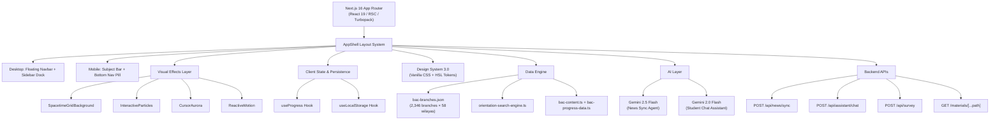

# 🇩🇿 THE ULTIMATE BAC HELP (باك الجزائر | رفيقك في التحضير)

# MASTER PROJECT RESUME & FULL TECHNICAL SPECIFICATIONS

> **For AI Assistants (Gemini, Claude, Antigravity) & Lead Developers**
> **Last Updated:** August 14, 2026
> **Reflecting:** Official MESRS 2026 Orientation Decree, July 29, 2026 Education Ministry Decree, Phase-1 Cutoffs

---

## 📌 1. EXECUTIVE SUMMARY & MISSION

**The Ultimate BAC Help** is a state-of-the-art, high-performance web application tailored specifically for Algerian Baccalaureate students (3AS — السنة الثالثة ثانوي) preparing for their national exams and university orientation.

### Platform Identity

| Attribute            | Value                                              |
| :------------------- | :------------------------------------------------- |
| **Arabic Name**      | باك الجزائر \| رفيقك في التحضير                    |
| **Framework**        | Next.js 16 (App Router / React 19 / Turbopack)     |
| **Deployment**       | Vercel (Production)                                |
| **Database Backend** | Google Sheets (via Apps Script) + Supabase (Surveys)|
| **AI Engine**        | Google Gemini API (2.5-flash, 2.0-flash-lite)      |
| **Design System**    | Pure Vanilla CSS 3.0 — Glassmorphism + HSL Tokens  |
| **Direction**        | Native RTL (`dir="rtl"`, `lang="ar"`)              |
| **Total Source**     | **51 files — 10,501 lines of code**                |
| **Total Project**    | **330+ files — ~930 MB (0.93 GB)**                 |

### Core Pillars (8 Feature Modules)

1. 🏠 **Interactive News & Official Updates Feed** (`/`)
2. 🎓 **University Orientation & Threshold Predictor Engine** (`/tools/orientation`)
3. 📚 **Curated Academic Library** (`/subject/[id]`)
4. 🧮 **Official BAC Grade Calculator** (`/calculator`)
5. 📊 **Coefficient-Weighted Progress Tracker** (`/progress`)
6. 🧪 **Prerequisites Diagnostic & Exercise Engine** (`/tools/prerequisites/quiz`)
7. 🛠️ **External Tools & Resource Directory** (`/tools`)
8. 🤖 **AI Study Assistant** (Floating Chat Widget)

---

## 🏗️ 2. TECHNOLOGY STACK & ARCHITECTURE



### Dependencies (`package.json`)

```json
{
  "dependencies": {
    "katex": "^0.18.1",
    "lucide-react": "^1.28.0",
    "next": "latest",
    "react": "latest",
    "react-dom": "latest"
  },
  "devDependencies": {
    "@types/katex": "^0.16.8",
    "@types/node": "latest",
    "@types/react": "latest",
    "@types/react-dom": "latest",
    "typescript": "~5.8.0"
  }
}
```

---

## 📂 3. COMPLETE PROJECT STRUCTURE

### A. Source Code Tree (`bac-platform/src/`)

```
src/
├── app/
│   ├── layout.tsx                          # Root HTML: RTL, Cairo font, KaTeX, anti-FOUC
│   ├── page.tsx                            # Homepage: Countdown, Ministerial, News Feed
│   ├── styles.css                          # Design System 3.0 (3,093 lines)
│   │
│   ├── calculator/page.tsx                 # 7-Stream BAC Grade Calculator
│   ├── progress/page.tsx                   # Weighted Progress Tracker
│   │
│   ├── subject/
│   │   ├── page.tsx                        # Subject Library Index (9 subjects)
│   │   └── [id]/
│   │       ├── page.tsx                    # Dynamic route resolver
│   │       └── subject-view.tsx            # Unit tabs, file cards, preview/download
│   │
│   ├── tools/
│   │   ├── page.tsx                        # Tools Hub Index
│   │   ├── orientation/page.tsx            # University Orientation Dual-Engine
│   │   ├── apps/page.tsx                   # Recommended Study Apps
│   │   ├── books/page.tsx                  # External Textbooks Directory
│   │   ├── notebooks/page.tsx              # NotebookLM AI Notebooks
│   │   ├── teachers/page.tsx               # YouTube Educators Directory
│   │   └── prerequisites/
│   │       ├── page.tsx                    # Prerequisite Videos Hub
│   │       └── quiz/page.tsx               # Diagnostic Quiz Engine (KaTeX)
│   │
│   ├── admin/survey/page.tsx               # Admin Survey Dashboard
│   │
│   ├── api/
│   │   ├── news/sync/route.ts              # Ministerial Scraper + Gemini Agent
│   │   ├── assistant/chat/route.ts         # AI Chat (Gemini, 8 queries/day)
│   │   ├── survey/route.ts                 # Onboarding → Google Sheets Webhook
│   │   └── admin/survey/route.ts           # Auth'd Supabase Survey Results
│   │
│   └── materials/[...path]/route.ts        # Static File Streaming Server
│
├── components/
│   ├── layout/
│   │   ├── app-shell.tsx                   # Main layout wrapper + ResizeObserver
│   │   ├── bottom-nav.tsx                  # Mobile bottom navigation pill
│   │   ├── mobile-subject-bar.tsx          # Horizontal subject scroller (RTL)
│   │   └── stream-bar.tsx                  # BAC stream filter pills
│   │
│   ├── effects/
│   │   ├── spacetime-grid-background.tsx   # Canvas gravity-well grid distortion
│   │   ├── interactive-particles.tsx       # 60-node constellation particles
│   │   ├── cursor-aurora.tsx               # Mouse-tracking radial glow
│   │   ├── reactive-motion.tsx             # 3D tilt, ripples, magnetic buttons
│   │   ├── fade-in-section.tsx             # IntersectionObserver entrance anim
│   │   └── water-ripple-background.tsx     # 2D wave equation water sim
│   │
│   ├── news/
│   │   ├── countdown-card.tsx              # Live BAC countdown timer
│   │   ├── ministerial-card.tsx            # Official decree hero card
│   │   └── news-feed.tsx                   # Categorized news stream + tabs
│   │
│   ├── assistant/
│   │   └── floating-assistant.tsx          # AI chat widget (Gemini backend)
│   │
│   ├── survey/
│   │   └── survey-modal.tsx                # First-time onboarding modal
│   │
│   ├── theme/
│   │   └── theme-toggle.tsx                # Light/Dark mode switch
│   │
│   └── ui/
│       ├── math-text.tsx                   # KaTeX LaTeX renderer ($...$, $$...$$)
│       └── support-card.tsx                # BaridiMob donation card
│
├── data/
│   ├── bac-branches.json                   # 2,346 MESRS branches (3.37 MB)
│   ├── bac-orientation-database.ts         # Types, formulas, career goals
│   ├── bac-content.ts                      # Subject file manifest (9 subjects)
│   ├── bac-progress-data.ts                # Curriculum units & lessons
│   ├── bac-exams.ts                        # Official/mock exam index
│   ├── prerequisites-quiz-data.ts          # Diagnostic question bank (959 lines)
│   ├── news-data.ts                        # News TypeScript interfaces
│   └── news-feed.json                      # Active news database
│
├── hooks/
│   ├── use-local-storage.ts                # SSR-safe persistent state hook
│   └── use-progress.ts                     # Weighted readiness computation
│
└── lib/
    ├── orientation-search-engine.ts        # Multilingual fuzzy search + scoring
    ├── news-service.ts                     # News feed read/write (fs/promises)
    └── subjects.ts                         # 9-subject master definitions
```

### B. Root Project Assets Tree

```
The Ultimate BAC Help/
├── bac-platform/                           # ← Next.js Application (see above)
│
├── Resumé of the Project/                  # Project documentation
│   ├── MASTER_PROJECT_RESUME.md            # This file
│   ├── README.md                           # Quick-start guide
│   └── codebase_bundle.txt                 # Consolidated code snapshot
│
├── رياضيات/                                # Mathematics (8 files, ~19.5 MB)
│   ├── PDFs/ملخص الاحتمالات.pdf
│   ├── Pictures/الاعداد المركبة.png
│   └── Pictures/المكتسبات القبلية/         # 4 prerequisite photos
│
├── فيزياء/                                 # Physics (6 files, ~69.2 MB)
│   ├── أهم الأسئلة النظرية.pdf
│   ├── باكلوريات تجريبية 2026.pdf
│   └── كتاب تمارين الفيزياء.pdf (×2)
│
├── علوم/                                   # Natural Sciences (91 files, ~325.8 MB)
│   ├── تجميعة بكالوريا تجريبية 2026/      # 67 regional mock exams
│   └── دروس مرقمة/                         # 24 numbered lessons (3 domains)
│
├── عربية/                                  # Arabic (5 files, ~20.2 MB)
│   ├── PDFs/ملخص حيقون الشعب العلمية.pdf
│   └── ملخصات اخر العام/                   # End-of-year summaries
│
├── فرنسية/                                 # French (4 files, ~188 KB)
│   └── 3 interactive HTML exam tools
│
├── english/                                # English (4 files, ~84.1 MB)
│   └── 3 comprehensive review PDFs
│
├── فلسفة/                                  # Philosophy (21 files, ~197.6 MB)
│   ├── الاشكالية الاولى/                   # 5 files (audio + infographics)
│   ├── الاشكالية الثانية/                  # 9 files (audio + PDF + essays)
│   └── الاشكالية الثالثة/                  # 7 files (audio + PDF + essays)
│
├── اسلامية/                                # Islamic Studies (5 files, ~15.7 MB)
│   ├── PDFs/ (3 comprehensive summaries)
│   └── Pictures/ (2 infographic PNGs)
│
├── تاريخ و جغرافيا/                        # History & Geography (50 files, ~149.3 MB)
│   ├── تاريخ/ (28 files: Cold War, Revolution, Liberation)
│   └── جغرافيا/ (22 files: World Economy, 3 Poles, Dev. Countries)
│
├── صور الكتب الخارجية/                     # 16 book cover images
├── ملف المكتسبات القبلية/                  # 10 prerequisite diagnostic files
├── Background Pictures/                    # 1 background asset (Hall.jpg)
├── Design and Js examples/                 # 10 UI prototype & effect files
│
├── README APPS.txt                         # 7 curated study apps
├── README BEST YOUTUBE TEACHERS.txt        # 18 YouTube channels × 9 subjects
├── README NOTEBOOKS.txt                    # 9 NotebookLM workspace URLs
├── README برامج.txt                        # Progress tracker specifications
├── README مكتسبات قبلية.txt                # Prerequisite revision guide
│
├── bac-domain-stream-priorities.json       # MESRS domain priorities
├── bac-domain-stream-priorities.md         # Priority documentation
├── BAC-2026-Fichier-des-moyennes-minimales-apres-phase-1.pdf  # Official cutoffs
├── circulaire-2026.pdf                     # Official MESRS circular (9 MB)
├── معدلات_القبول_المدارس_العليا_للأساتذة.txt  # ENS cutoffs report (254 KB)
└── antigravity-final-audit-prompt.md       # AI audit prompt
```

---

## 🎓 4. DETAILED FEATURE SPECIFICATIONS

### A. 🏠 Homepage & Live News Engine (`/`)

| Component          | File                          | Lines | Purpose                                                |
| :----------------- | :---------------------------- | :---: | :----------------------------------------------------- |
| Homepage           | `app/page.tsx`                | 80    | Server Component: fetches news, renders hero + feed    |
| Countdown Card     | `components/news/countdown-card.tsx` | 51 | Live timer to BAC 2027 (days/hours/minutes)            |
| Ministerial Card   | `components/news/ministerial-card.tsx` | 186 | Official decree card with PDF, badges, AI explanation |
| News Feed          | `components/news/news-feed.tsx` | 182 | Tabbed category stream with expandable cards           |
| News Service       | `lib/news-service.ts`         | 35    | `fs/promises` read/write to `news-feed.json`           |
| News Sync API      | `api/news/sync/route.ts`      | 176   | LLM scraper: `education.gov.dz` → Gemini → JSON       |

**News Sync Pipeline:**
1. Fetches raw HTML from `education.gov.dz`
2. Pre-extracts verified `href` attributes (anti-hallucination)
3. Invokes `gemini-2.5-flash` with structured JSON schema
4. Generates student-friendly `💡 الشرح المبسط` summaries
5. Persists to `src/data/news-feed.json`

---

### B. 🎓 University Orientation Engine (`/tools/orientation`)

**524 lines** — The flagship feature of the platform.

#### Dataset
- **2,346 university branches** across all **58 Wilayas** in Algeria
- Extracted from official MESRS Circulaire 01 and Phase-1 cutoffs PDF
- **277 institution codes** resolved to accurate Wilayas & city names

#### Official 3-Tier Cutoff System (`Min1`, `Min2`, `Min3`)

| Institution                    | Code      | Formula | Min1 (Math) | Min2 (Sci) | Min3 (Tech) |
| :----------------------------- | :-------- | :-----: | :---------: | :--------: | :---------: |
| ESI Algiers                    | C00CAN01  | MI      | 18.13       | 18.48      | 18.91       |
| ESI Sidi Bel Abbes             | C00CAN02  | MI      | —           | —          | —           |
| ESTIN Bejaia                   | C00CAN03  | MI      | —           | —          | —           |
| ENSIA AI                       | C00CAN04  | MI      | 18.44       | 18.81      | 19.21       |
| ENSM Math                      | C00CAN05  | MI      | 17.43       | 17.77      | 18.13       |
| Cybersecurity                  | C00CAN07  | MI      | 18.10       | 18.46      | 18.85       |
| ENSSA Autonomous Systems       | A00CAN13  | ST      | 18.06       | —          | —           |
| ENSNN Nanotechnology           | A00CAN14  | ST      | 17.69       | —          | —           |

#### Official Weighted Average Formulas ($\mathfrak{g^i}$)

$$\text{Health: } \mathfrak{g^i} = \frac{2 \times \text{BAC} + \text{SVT}}{3}$$

$$\text{ST: } \mathfrak{g^i} = \frac{2 \times \text{BAC} + \frac{\text{Physique} + \text{Math}}{2}}{3}$$

$$\text{MI: } \mathfrak{g^i} = \frac{2 \times \text{BAC} + \text{Math}}{3}$$

$$\text{AUM: } \mathfrak{g^i} = \frac{2 \times \text{BAC} + \frac{\text{Physique} + \text{Math}}{2}}{3}$$

$$\text{Languages: } \mathfrak{g^i} = \frac{2 \times \text{BAC} + \text{Langue}}{3}$$

$$\text{Translation: } \mathfrak{g^i} = \frac{2 \times \text{BAC} + \frac{\text{Arabe} + \text{Français} + \text{Anglais}}{3}}{3}$$

#### Dual-Mode Interface

| Mode | Name | Description |
| :--: | :--- | :---------- |
| 1 | **📊 مستكشف التوجيه بمعدلي** (Predictor Explorer) | Takes student average + core subject grades → real-time weighted scores → 5 color-coded status badges |
| 2 | **🎯 حاسبة جامعة أحلامي** (Dream University) | Smart autocomplete → cutoff comparison → key subject recommendations |

#### 5 Status Badges

| Badge | Arabic | Condition |
| :---- | :----- | :-------- |
| 🟢 `safe` | مضمونة بإذن الله | Difference ≥ +0.50 |
| 🟡 `competitive` | منافسة قوية | Difference between −0.50 and +0.50 |
| 🔴 `stretch` | تتطلب رفع النقاط | Difference < −0.50 |
| ⚪ `nc` | خاضع للمرحلة الثانية | Pending Phase 2 |
| ⛔ `unavailable` | غير متاح لشعبتك | Stream not eligible |

#### 8 Structural Sectors

`Medical` · `HigherSchool` · `Engineering` · `ENS` · `DoubleDegree` · `Professional` · `DistanceLearning` · `University`

#### 7 Career Goal Categories

🩺 `doctor` · 💻 `software_ai` · 👨‍🏫 `teacher` · 🏛️ `architect` · ⚙️ `engineer` · 📊 `business_finance` · 🌐 `general`

---

### C. 📚 Subject Library (`/subject/[id]`)

- **9 subjects** with dynamic routing, unit tabs, and file cards
- Preview/download for PDFs, interactive HTMLs, images, and audio
- GitHub Pages raw URL fallback for self-hosted deployments
- Experimental mock exam collections integrated per subject

---

### D. 🧮 BAC Grade Calculator (`/calculator`)

**218 lines** — Supports all **7 official streams** with 2026 decree coefficients:

| Stream | Arabic | Coefficient Total |
| :----- | :----- | :---------------: |
| Scientific | علوم تجريبية | 29 |
| Mathematical | رياضيات | 29 |
| Technical Engineering | تقني رياضي | 29 |
| Literature & Philosophy | آداب و فلسفة | 29 |
| Foreign Languages | لغات أجنبية | 29 |
| Management & Economics | تسيير و اقتصاد | 29 |
| Arts | فنون | 29 |

Features: Real-time computation, comma-to-dot normalization, reset controls.

---

### E. 📊 Progress Tracker (`/progress`)

**135 lines** — Computes the weighted BAC Readiness Index:

$$\text{BAC Readiness Index} = \frac{\sum_{s=1}^{n}(P_s \times C_s)}{\sum_{s=1}^{n} C_s}$$

Where $P_s$ = progress percentage of subject $s$, $C_s$ = official coefficient.

- 3-state lesson tracking: `NOT_STARTED` → `IN_PROGRESS` → `COMPLETED`
- Categorized unit checklists per subject
- Persistent via `useProgress` hook + localStorage

---

### F. 🧪 Prerequisites Diagnostic Engine (`/tools/prerequisites/quiz`)

**442 lines** — Interactive quiz + comprehensive solved exercises.

- **3 subjects**: Mathematics ∑, Physical Sciences ⚛, Natural Sciences 🧬
- **10 diagnostic questions** per subject (MCQ + True/False)
- **KaTeX rendering** via `<MathText/>` component for all math expressions
- **Step-by-step solved exercises** with illustrated solutions
- **Scoring system** with diagnostic badges and instant explanations
- **Question bank**: 959 lines in `prerequisites-quiz-data.ts`

---

### G. 🤖 AI Study Assistant

**228 lines** (`floating-assistant.tsx`) + **141 lines** (`api/assistant/chat/route.ts`)

- Floating chat widget accessible from every page
- Powered by Google Gemini API (`gemini-2.5-flash-lite` / `gemini-2.0-flash`)
- **8 queries/day** rate limit per IP address
- Specialized system prompt covering BAC branches, tools, and platform URLs
- Quick suggestion chips for common questions
- localStorage conversation history persistence
- Graceful API error handling

---

### H. 📋 Survey & Onboarding System

| Component | File | Lines | Purpose |
| :-------- | :--- | :---: | :------ |
| Survey Modal | `components/survey/survey-modal.tsx` | 140 | First-time visitor onboarding (name, stream, target) |
| Survey API | `api/survey/route.ts` | 47 | Forwards to Google Sheets webhook |
| Admin Dashboard | `app/admin/survey/page.tsx` | 131 | Password-protected analytics view |
| Admin API | `api/admin/survey/route.ts` | 28 | Supabase survey results retrieval |

---

## 🎨 5. DESIGN SYSTEM & VISUAL EFFECTS

### CSS Design System 3.0 (`styles.css` — 3,093 lines)

| Token Category | Examples |
| :------------- | :------- |
| **Surface Colors** | `--bg-page`, `--surface-1`, `--surface-2`, `--glass-bg` |
| **Text Colors** | `--text-primary`, `--text-secondary`, `--text-muted` |
| **Brand Colors** | `--blue-800`, `--blue-600`, `--blue-50`, `--accent-*` |
| **Layout Vars** | `--header-height` (ResizeObserver), `--bottom-nav-height` |
| **Effects** | `backdrop-filter: blur()`, glassmorphism layers |
| **Typography** | Cairo (Arabic), Inter, Outfit, Manrope (Latin) |

### 6 Visual Effects Engines

| Effect | File | Lines | Technology |
| :----- | :--- | :---: | :--------- |
| **Spacetime Grid** | `spacetime-grid-background.tsx` | 222 | Canvas: gravity-well cursor distortion |
| **Interactive Particles** | `interactive-particles.tsx` | 132 | Canvas: 60-node constellation + cursor repulsion |
| **Cursor Aurora** | `cursor-aurora.tsx` | 39 | CSS: mouse-tracking radial gradient glow |
| **Reactive Motion** | `reactive-motion.tsx` | 129 | DOM: 3D tilt, magnetic buttons, click ripples |
| **Fade-In Sections** | `fade-in-section.tsx` | 56 | IntersectionObserver entrance animations |
| **Water Ripple** | `water-ripple-background.tsx` | 187 | Canvas: 2D wave equation refraction sim |

### Design Principles

- **Touch Accessibility**: All touch targets ≥ 48px
- **RTL-First**: Native `dir="rtl"` with `Math.abs()` scroll normalization
- **Theme Support**: Light/Dark mode via `theme-toggle.tsx` + localStorage
- **Micro-animations**: Active scaling (`transform: scale(0.97)`), smooth transitions
- **Responsive Breakpoints**: Mobile-first with `@media (max-width: 768px)` overrides
- **Dynamic Layout**: `--header-height` and `--bottom-nav-height` measured via `ResizeObserver`

---

## 📊 6. LINES OF CODE METRICS

| Category | Extensions | Files | Lines |
| :------- | :--------: | :---: | ----: |
| Page & View Components (`app/**`) | `.tsx` | 17 | 2,679 |
| Feature & UI Components (`components/**`) | `.tsx` | 17 | 2,091 |
| API Route Handlers (`api/**`, `materials/`) | `.ts` | 5 | 459 |
| Business Logic & Libraries (`lib/**`) | `.ts` | 3 | 287 |
| Custom React Hooks (`hooks/**`) | `.ts` | 2 | 127 |
| Data Manifests & Models (`data/**`) | `.ts` | 6 | 1,765 |
| Design System (`styles.css`) | `.css` | 1 | 3,093 |
| **Total Source Code** | — | **51** | **10,501** |

> **Note:** In addition to 10,501 lines of source code, `bac-branches.json` provides **3.37 MB** of structured JSON orientation data.

---

## 📁 7. CONTENT ASSETS INVENTORY

| Subject Folder | Files | Size | Primary Formats |
| :------------- | :---: | :--- | :-------------- |
| رياضيات (Mathematics) | 8 | ~19.5 MB | PDF, PNG, JPG |
| فيزياء (Physics) | 6 | ~69.2 MB | PDF |
| علوم (Natural Sciences) | 91 | ~325.8 MB | PDF, RAR, DOCX, PNG, HTML |
| عربية (Arabic) | 5 | ~20.2 MB | PDF, JPG |
| فرنسية (French) | 4 | ~188 KB | HTML (interactive tools) |
| english (English) | 4 | ~84.1 MB | PDF |
| فلسفة (Philosophy) | 21 | ~197.6 MB | M4A (audio), PDF, PNG, DOCX |
| اسلامية (Islamic Studies) | 5 | ~15.7 MB | PDF, PNG |
| تاريخ و جغرافيا (History & Geo) | 50 | ~149.3 MB | PDF, PNG, JPG, HTML, RAR |
| صور الكتب الخارجية (Book Covers) | 16 | ~0.65 MB | WEBP, JPG |
| ملف المكتسبات القبلية (Prerequisites) | 10 | ~15.0 MB | PDF, JPG |
| **Content Subtotal** | **~220** | **~897 MB** | Multi-format |

### Content Highlights

- **91 Natural Sciences files** including 67 regional mock exams from BAC Expérimental 2026 across 20+ wilayas
- **21 Philosophy files** with original audio recordings (M4A podcasts on ethics, determinism, freedom)
- **50 History & Geography files** organized by 3 thematic units per subject with interactive HTML tools
- **3 French interactive HTML tools** for guided BAC writing practice
- **16 book cover images** for the external textbooks recommendation module

---

## 🌐 8. API ROUTES REFERENCE

| Method | Endpoint | Auth | Purpose |
| :----: | :------- | :--: | :------ |
| `POST` | `/api/news/sync` | None | Scrape `education.gov.dz` → Gemini summarization → save |
| `GET` | `/api/news/sync` | None | Retrieve current cached news |
| `POST` | `/api/assistant/chat` | IP rate-limit (8/day) | Gemini-powered student Q&A |
| `POST` | `/api/survey` | None | Submit onboarding data → Google Sheets |
| `POST` | `/api/admin/survey` | Password | Retrieve Supabase survey results |
| `GET` | `/materials/[...path]` | None | Stream files (PDF, M4A, PNG, RAR) |

---

## 🔗 9. EXTERNAL INTEGRATIONS

| Integration | Purpose | Access Method |
| :---------- | :------ | :------------ |
| **Google Gemini API** | News summarization + Student AI chat | `GEMINI_API_KEY` env var |
| **Google Apps Script** | Survey data → Google Sheets sync | Webhook URL in env |
| **Supabase** | Survey storage & admin retrieval | Supabase client |
| **Google NotebookLM** | 9 subject-specific AI notebooks | Direct URLs per subject |
| **education.gov.dz** | Official ministerial news scraping | HTML fetch + href extraction |
| **GitHub Pages** | Fallback file hosting | Raw content URLs |
| **Vercel** | Production hosting & deployment | Git push to `main` |

---

## ⚡ 10. BUILD & DEPLOYMENT

```bash
# Development
npm run dev                    # Turbopack dev server → http://localhost:3000

# Production
npm run build                  # Full static build (22 routes)
npm start                      # Serve production build

# Verification
# ✅ TypeScript: 0 errors (~6s check)
# ✅ Static Pages: 22/22 generated
# ✅ Deployment: Vercel auto-deploy on push to main
```

### Environment Variables (`.env.local`)

```
GEMINI_API_KEY=...              # Google Gemini API key
GOOGLE_SCRIPT_URL=...          # Google Apps Script webhook
ADMIN_PASSWORD=...             # Admin survey dashboard password
```

---

## 📝 11. CURATED RESOURCES SUMMARY

### Best Study Apps (Ranked)

1. **YPT (Yeolpumta)** — Time tracking with daily/weekly/monthly analytics per subject
2. **Quizlet** — Spaced repetition flashcards with ready-made Algerian decks
3. **BAC DZ App** — Previous BAC topics with model solutions
4. **Desmos** — Graphing calculator (offline-capable)
5. **NotebookLM** — AI tutor answering strictly from uploaded sources
6. **CamScanner** — Document scanning for archiving
7. **Tarteel** — Quran recitation and memorization

### Top YouTube Educators (18 channels × 9 subjects)

| Subject | Educators |
| :------ | :-------- |
| رياضيات | الأستاذ نور الدين, الأستاذ عبد الباسط |
| فيزياء | الأستاذ عبد الله, الأستاذ عبد اللطيف |
| علوم | الأستاذة خيرة فليتي, الأستاذ شاوش |
| عربية | الأستاذ بوبكر مبروك, الأستاذ حيقون أسامة, الأستاذ شريفي |
| فلسفة | الأستاذ خليل سعيداني, الأستاذ عادل مقرود |
| تاريخ/جغرافيا | الأستاذ بورنان, الأستاذ عبد النور خليفي |
| اسلامية | الأستاذة بوسعادي, الأستاذ شمس الدين |
| فرنسية | الأستاذ منصوري, Prof Elnadjah |
| انجليزية | الأستاذ أمين إنجليش, الأستاذ منصوري |

---

## 🔧 12. CONFIGURATION FILES

### `next.config.ts`

```typescript
import type { NextConfig } from "next";
const nextConfig: NextConfig = {
  images: {
    remotePatterns: [{ protocol: "https", hostname: "**" }],
  },
};
export default nextConfig;
```

### `tsconfig.json`

- **Target:** ES2022
- **Module:** ESNext (Bundler resolution)
- **Strict Mode:** Enabled
- **Path Aliases:** `@/*` → `./src/*`
- **JSON Module Resolution:** Enabled

### `.gitignore`

```
node_modules/
.next/
out/
.env*.local
.vercel/
.DS_Store
*.rar
*.zip
```

---

> **Note for AI Assistants:** This document serves as the authoritative sitemap and technical specification for *The Ultimate BAC Help* platform. When modifying or suggesting updates, always ensure compatibility with Next.js 16 App Router, Pure Vanilla CSS tokens, the 2,346 branch dataset in `bac-branches.json`, and the RTL-first Arabic interface architecture.
